<h1 align="center">Hi there, I'm Afif Ur Rahman 👋</h1>
<h3 align="center">Full Stack Developer | Backend-Focused Engineer | Building Scalable Web & Mobile Applications</h3>

  

  
  
  

---

### 👨‍💻 About Me

I'm a full stack developer with a strong focus on backend engineering, specializing in building production-grade web and mobile applications end to end. My work spans **Next.js/TypeScript** frontends, **Node.js/Express/MongoDB** backends, and **React Native** mobile apps published on the Google Play Store.

- 🔭 Currently leading development of **[The Conqueror Developers](https://theconquerordevelopers.com/)** — a full-scale real estate management platform covering property listings, customer management, and payment/receipt processing
- 📱 Building and shipping cross-platform mobile applications with React Native, from secure vault apps to marketplace and social platforms
- 🏗️ Strong advocate for clean, maintainable architecture — separation of concerns between logic (custom hooks/services) and presentation
- 🧠 Invest time regularly in mastering algorithms and data structures from first principles
- 🤝 Open to collaboration on full-stack, backend, or React Native mobile projects

---

### 🧰 Tech Stack

  

📱 **Mobile:** React Native · Expo · TypeScript · Styled Components  
🎨 **Frontend:** Next.js · React · TypeScript · Tailwind CSS · Zustand  
⚙️ **Backend:** Node.js · Express · MongoDB  
🛠️ **Tooling:** ESLint · Prettier · Jest · Husky · Git

---

### 📌 Featured Projects

#### 🏢 [The Conqueror Developers](https://theconquerordevelopers.com/)
Real estate management platform for a property development company — handles property/unit listings, customer profiles, and a full payment & receipts system with custom and installment-based payment plans.
**Stack:** Next.js, TypeScript, Zustand, Node.js, Express, MongoDB

#### 🔐 [Secure Vault - Data](https://play.google.com/store/apps/details?id=com.securevault.hasbi)
A secure file-vault mobile application with 3-step authentication (PIN, secret word, pattern) and progressive lockout protection. Includes full file management — upload, preview, download, deletion, and category filtering — plus admin tools for user/file management and credential updates.
**Stack:** React Native, TypeScript, Node.js, Tailwind CSS

#### 🏘️ [YallahNshoof](https://play.google.com/store/apps/details?id=com.yallahnshoof)
An all-in-one marketplace app for buying, selling, and renting properties, vehicles, and other listed items. Features quick listing creation with photos and pricing, smart search and filters, in-app chat between buyers and sellers, and a secure, user-friendly experience.
**Key Features:** Property & vehicle buy/sell/rent · Quick listing creation · Smart search & filters · Direct in-app messaging · Secure marketplace flow
**Stack:** React Native, Styled Components, TypeScript, Tailwind CSS, Node.js, Next.js

#### 🐾 Petzap – Pet Social Networking & Management Platform
A cross-platform mobile app combining social networking with practical pet management. Users can create profiles, connect with other pet owners, share posts, and stay engaged through real-time push notifications.
**Key Features:** Pet owner social network · Photo sharing & community engagement · Profile & location management · Real-time notifications via OneSignal · Cross-platform (iOS & Android)
**Stack:** React Native, TypeScript, Styled Components, Node.js

---

### 🗂️ Other Repositories

<table width="100%">
  <thead>
    <tr>
      <th width="25%">Project</th>
      <th width="55%">Description</th>
      <th width="20%">Stack</th>
    </tr>
  </thead>
  <tbody>
    <tr>
      <td>💱 <a href="https://github.com/Afif-Ur-Rahman/Currency-Converter">Currency Converter</a></td>
      <td>Real-time currency conversion tool</td>
      <td>JavaScript</td>
    </tr>
    <tr>
      <td>🎨 <a href="https://github.com/Afif-Ur-Rahman/Color-Generator">Color Generator</a></td>
      <td>Random color/palette generator utility</td>
      <td>JavaScript</td>
    </tr>
    <tr>
      <td>💌 <a href="https://github.com/Afif-Ur-Rahman/Wedding-Invitation">Wedding Invitation</a></td>
      <td>A styled digital wedding invitation page</td>
      <td>HTML, CSS</td>
    </tr>
    <tr>
      <td>⚛️ <a href="https://github.com/Afif-Ur-Rahman/chai-aur-react">chai-aur-react</a></td>
      <td>React fundamentals learning project</td>
      <td>JavaScript</td>
    </tr>
  </tbody>
</table>

---

### 📊 GitHub Stats

  

  

---

---

### 🐍 Contribution Snake

  

---

### 🏆 Achievements

  
  

---

  <i>Thanks for stopping by — feel free to explore my work or reach out to connect!</i>

